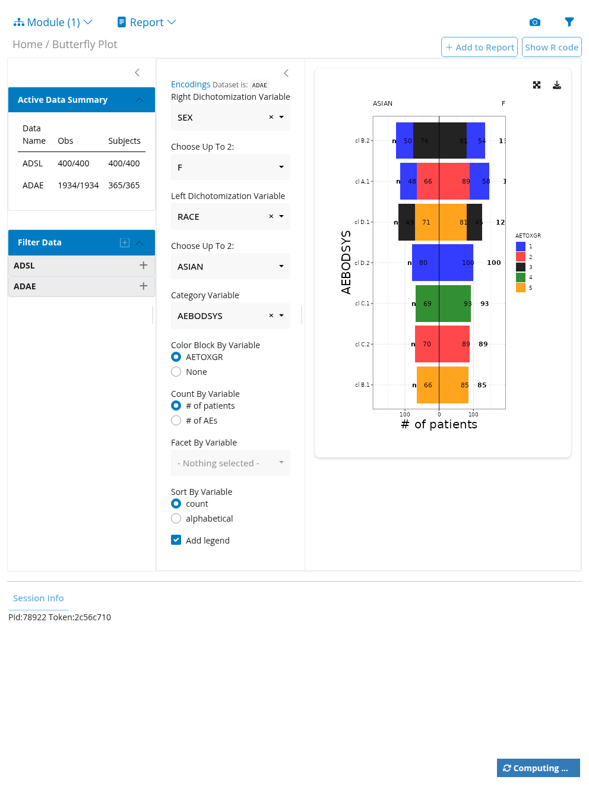
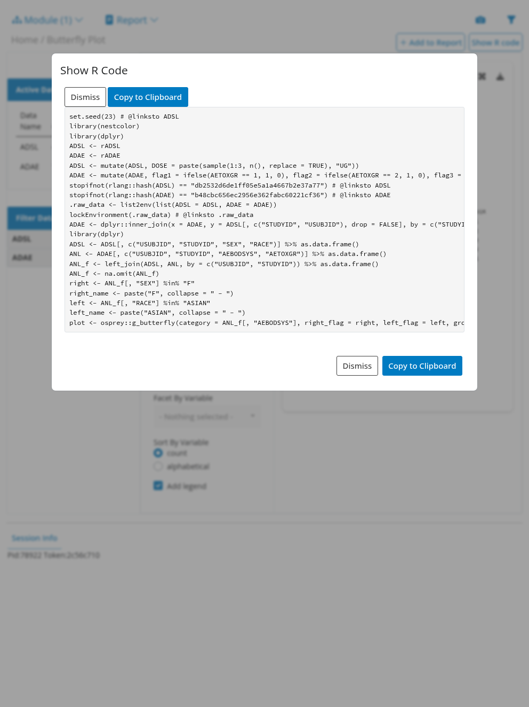
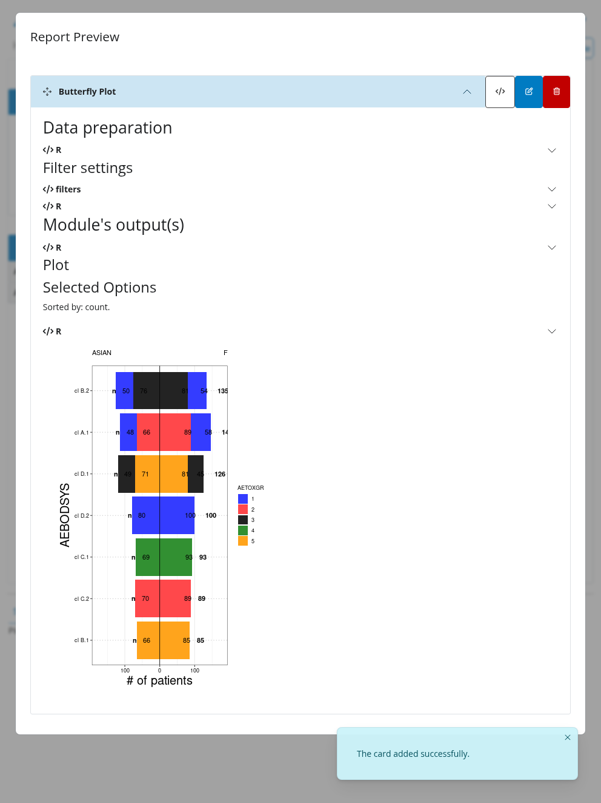
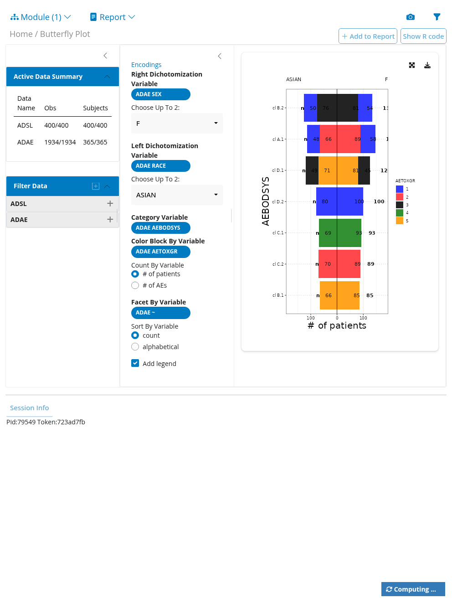
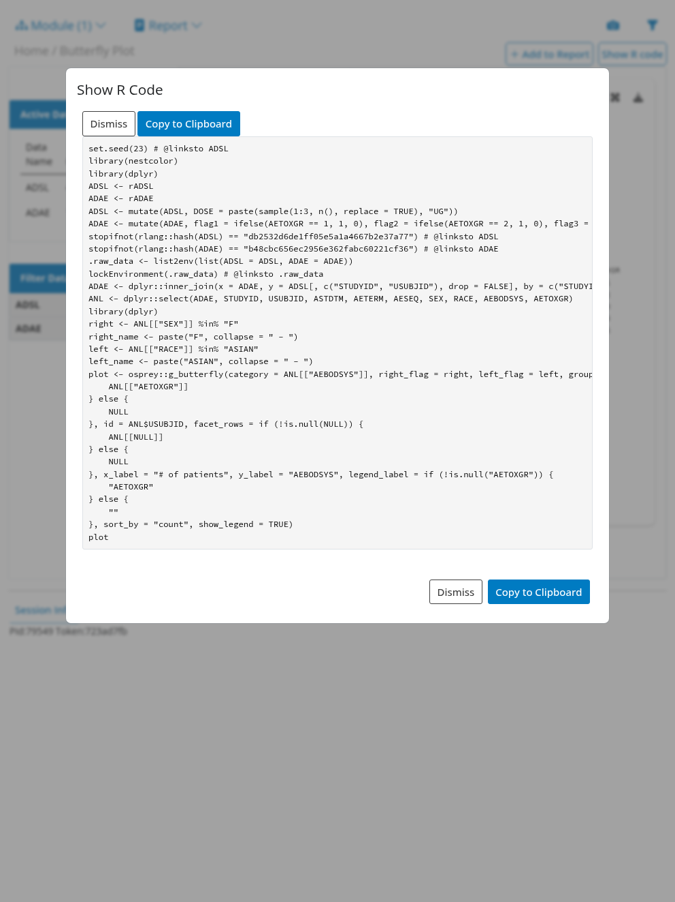
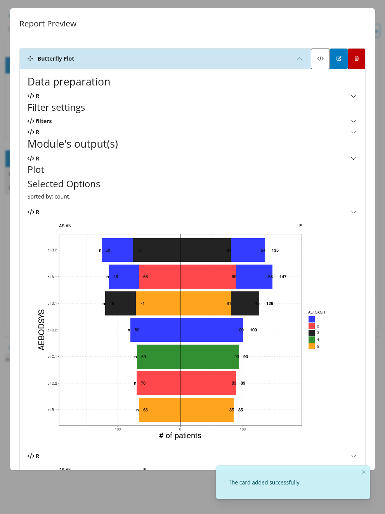

# test-module: tm_g_butterfly - main vs redesign_extraction@main

## Summary

- Module output (main vs redesign_extraction@main): Unable to verify automatically - screenshots captured for both branches; requires manual visual comparison.
- Teal report preview (expanded cards): Different - normalized report preview text differs.
- Show R Code / reproducibility: Different - normalized Show R Code text differs.
- Should code paths yield same results?: Yes
- Final status: Passed

## Screenshots

| Branch | Module output | Show R Code modal | Report -> Show Report |
|---|---|---|---|
| main |  |  |  |
| redesign_extraction@main |  |  |  |

## Show R Code files

- main: test-module-reports/2026-08-14-tm_g_butterfly-main-show-r-code.R
- redesign_extraction@main: test-module-reports/2026-08-14-tm_g_butterfly-redesign_extraction@main-show-r-code.R

## Show R Code diff

```diff
--- /home/osenan/Documents/Appsilon/Pharmaverse/teal.osprey/test-module-reports/2026-08-14-tm_g_butterfly-main-show-r-code.R	2026-08-14 08:30:41.503307708 +0200
+++ /home/osenan/Documents/Appsilon/Pharmaverse/teal.osprey/test-module-reports/2026-08-14-tm_g_butterfly-redesign_extraction@main-show-r-code.R	2026-08-14 08:31:03.331561200 +0200
@@ -10,13 +10,23 @@
 .raw_data <- list2env(list(ADSL = ADSL, ADAE = ADAE))
 lockEnvironment(.raw_data) # @linksto .raw_data
 ADAE <- dplyr::inner_join(x = ADAE, y = ADSL[, c("STUDYID", "USUBJID"), drop = FALSE], by = c("STUDYID", "USUBJID"))
+ANL <- dplyr::select(ADAE, STUDYID, USUBJID, ASTDTM, AETERM, AESEQ, SEX, RACE, AEBODSYS, AETOXGR)
 library(dplyr)
-ADSL <- ADSL[, c("USUBJID", "STUDYID", "SEX", "RACE")] %>% as.data.frame()
-ANL <- ADAE[, c("USUBJID", "STUDYID", "AEBODSYS", "AETOXGR")] %>% as.data.frame()
-ANL_f <- left_join(ADSL, ANL, by = c("USUBJID", "STUDYID")) %>% as.data.frame()
-ANL_f <- na.omit(ANL_f)
-right <- ANL_f[, "SEX"] %in% "F"
+right <- ANL[["SEX"]] %in% "F"
 right_name <- paste("F", collapse = " - ")
-left <- ANL_f[, "RACE"] %in% "ASIAN"
+left <- ANL[["RACE"]] %in% "ASIAN"
 left_name <- paste("ASIAN", collapse = " - ")
-plot <- osprey::g_butterfly(category = ANL_f[, "AEBODSYS"], right_flag = right, left_flag = left, group_names = c(right_name, left_name), block_count = "# of patients", block_color = ANL_f[, "AETOXGR"], id = ANL_f$USUBJID, facet_rows = NULL, x_label = "# of patients", y_label = "AEBODSYS", legend_label = "AETOXGR", sort_by = "count", show_legend = TRUE)
+plot <- osprey::g_butterfly(category = ANL[["AEBODSYS"]], right_flag = right, left_flag = left, group_names = c(right_name, left_name), block_count = "# of patients", block_color = if (!is.null("AETOXGR")) {
+    ANL[["AETOXGR"]]
+} else {
+    NULL
+}, id = ANL$USUBJID, facet_rows = if (!is.null(NULL)) {
+    ANL[[NULL]]
+} else {
+    NULL
+}, x_label = "# of patients", y_label = "AEBODSYS", legend_label = if (!is.null("AETOXGR")) {
+    "AETOXGR"
+} else {
+    ""
+}, sort_by = "count", show_legend = TRUE)
+plot
```

---

## Appendix: example app source (@examples)

### Branch main

```r
# Example using stream (ADaM) dataset
data <- teal_data() %>%
  eval_code("set.seed(23) # @linksto ADSL") %>%
  within({
    library(nestcolor)
    library(dplyr)
    ADSL <- rADSL
    ADAE <- rADAE
    ADSL <- mutate(ADSL, DOSE = paste(sample(1:3, n(), replace = TRUE), "UG"))
    ADAE <- mutate(
      ADAE,
      flag1 = ifelse(AETOXGR == 1, 1, 0),
      flag2 = ifelse(AETOXGR == 2, 1, 0),
      flag3 = ifelse(AETOXGR == 3, 1, 0),
      flag1_filt = rep("Y", n())
    )
  })

join_keys(data) <- default_cdisc_join_keys[names(data)]

app <- init(
  data = data,
  modules = modules(
    tm_g_butterfly(
      label = "Butterfly Plot",
      dataname = "ADAE",
      right_var = choices_selected(
        selected = "SEX",
        choices = c("SEX", "ARM", "RACE")
      ),
      left_var = choices_selected(
        selected = "RACE",
        choices = c("SEX", "ARM", "RACE")
      ),
      category_var = choices_selected(
        selected = "AEBODSYS",
        choices = c("AEDECOD", "AEBODSYS")
      ),
      color_by_var = choices_selected(
        selected = "AETOXGR",
        choices = c("AETOXGR", "None")
      ),
      count_by_var = choices_selected(
        selected = "# of patients",
        choices = c("# of patients", "# of AEs")
      ),
      facet_var = choices_selected(
        selected = NULL,
        choices = c("RACE", "SEX", "ARM")
      ),
      sort_by_var = choices_selected(
        selected = "count",
        choices = c("count", "alphabetical")
      ),
      legend_on = TRUE,
      plot_height = c(600, 200, 2000)
    )
  )
)
```

### Branch redesign_extraction@main

```r
data <- teal_data() %>%
  eval_code("set.seed(23) # @linksto ADSL") %>%
  within({
    library(nestcolor)
    library(dplyr)
    ADSL <- rADSL
    ADAE <- rADAE
    ADSL <- mutate(ADSL, DOSE = paste(sample(1:3, n(), replace = TRUE), "UG"))
    ADAE <- mutate(
      ADAE,
      flag1 = ifelse(AETOXGR == 1, 1, 0),
      flag2 = ifelse(AETOXGR == 2, 1, 0),
      flag3 = ifelse(AETOXGR == 3, 1, 0),
      flag1_filt = rep("Y", n())
    )
  })

join_keys(data) <- default_cdisc_join_keys[names(data)]

app <- init(
  data = data,
  modules = modules(
    tm_g_butterfly(
      label = "Butterfly Plot",
      dataname = "ADAE",
      right_var = variables(
        choices = c("SEX", "ARM", "RACE"),
        selected = "SEX"
      ),
      left_var = variables(
        choices = c("SEX", "ARM", "RACE"),
        selected = "RACE"
      ),
      category_var = variables(
        choices = c("AEDECOD", "AEBODSYS"),
        selected = "AEBODSYS"
      ),
      color_by_var = variables(
        choices = c("AETOXGR"),
        selected = "AETOXGR",
        "allow-clear" = TRUE,
        fixed = FALSE
      ),
      count_by_var = values(
        choices = c("# of patients", "# of AEs"),
        selected = "# of patients"
      ),
      facet_var = variables(
        choices = c("RACE", "SEX", "ARM"),
        selected = NULL
      ),
      sort_by_var = values(
        choices = c("count", "alphabetical"),
        selected = "count"
      )
    )
  )
)
```
